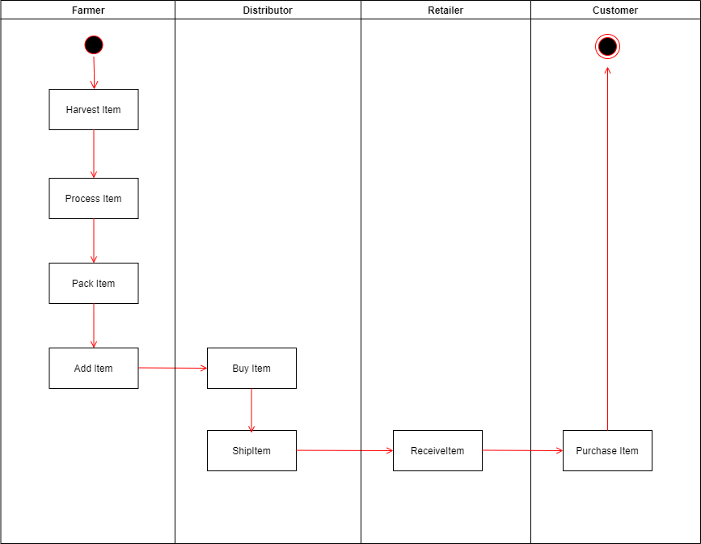
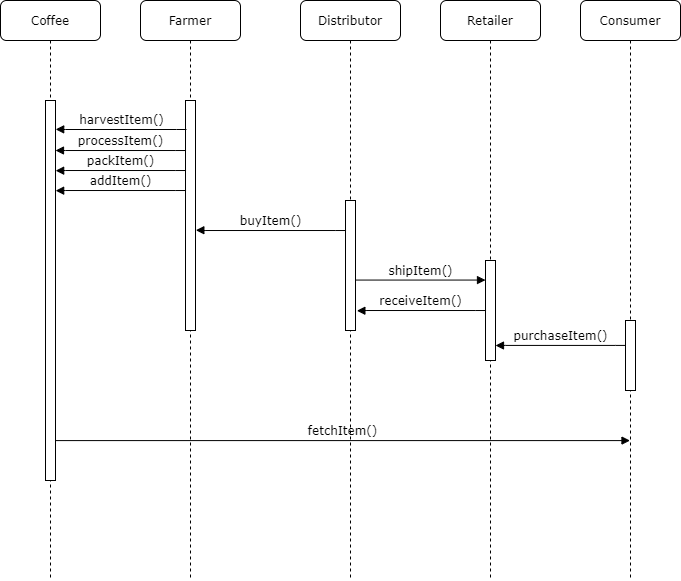
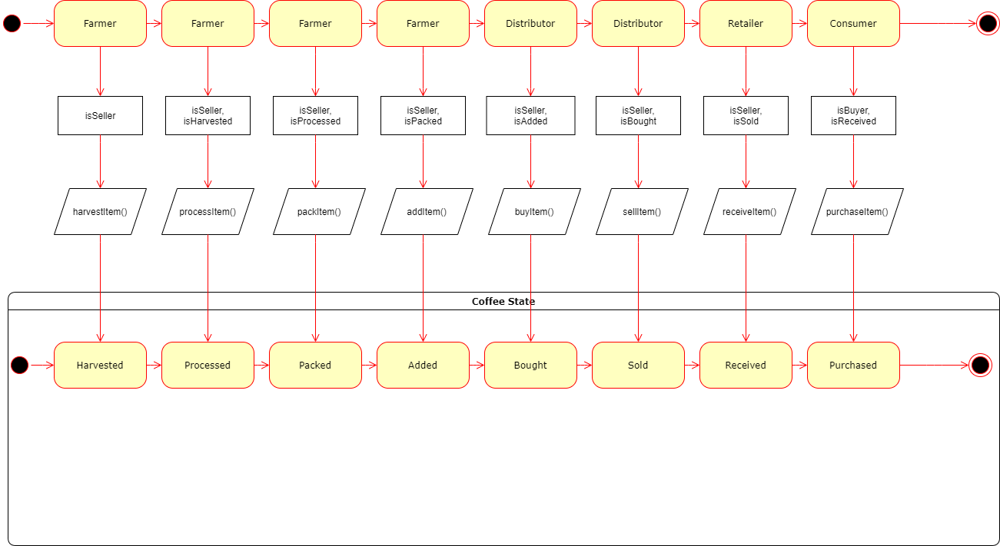
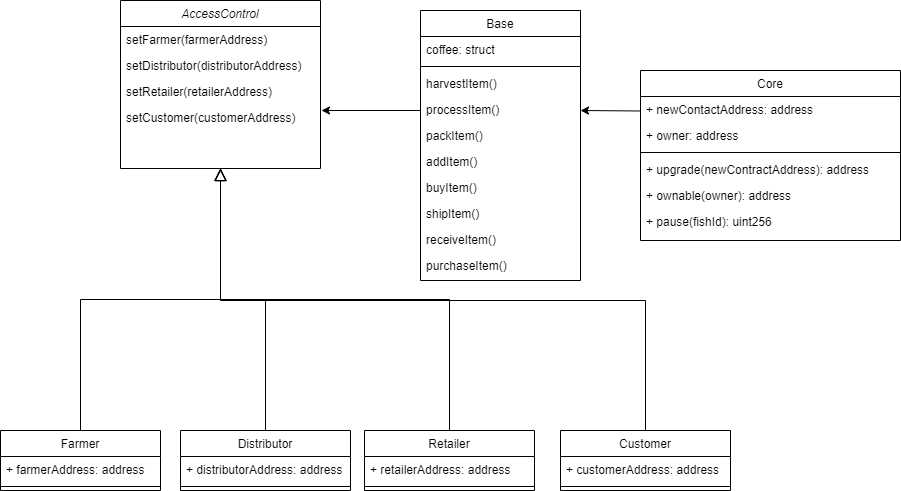
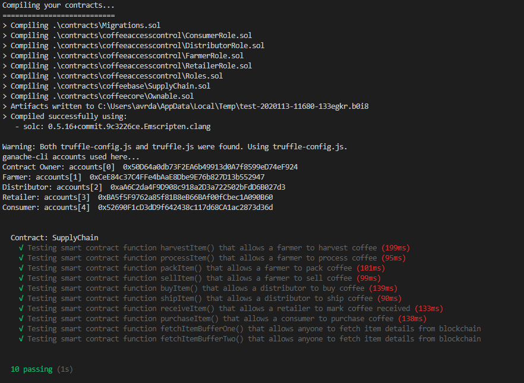

# Ethereum Dapp for Tracking Items through Supply Chain

The same project as the provided sample was used - Fair Trade coffee.
Therefore:

* the UML diagrams were created accordingyly
* the skeleton code was filled in with the appropriate contents
* all tests have been passed
* UX adapted so that it works on a Ganache test network

## Contract Address

Supply Chain contract address:
https://ropsten.etherscan.io/address/0x1b8256c9944480579A36306841E00B29D226c709
Please see the more detailed section below of the migration
to the Ropsten network. 

It includes all contract addresses.

## Libraries

No additional libraries used, as I started from the same project template.
IPFS was not used.

## Versions

* node: v12.18.1
* npm: v6.14.5
* Truffle: v5.1.13
* web3: web3.version returns api "0.20.7"

## Project Files

All project files are included in the nested folders.

The same file struture as in the original template has been kept.

Note that some paths had to be corrected for the frontend to work correctly.


I started the <b>index.html</b> using a <b>VS Code</b> plugin with the file selected.

The location from which the web interface is started matters, 

due to hardcoded paths towards the JS scripts (like for the <b>SupplyChain</b> contract).

## UML Documents


*Activity Diagram*


*Sequence Diagram*


*State Diagram*


*Class Diagram*

## Compilation and Test Results



## Deployment to Public Test Network (Ropsten)
```
Starting migrations...
======================
> Network name:    'ropsten'
> Network id:      3
> Block gas limit: 0x7a1200


1_initial_migration.js
======================

   Replacing 'Migrations'
   ----------------------
   > transaction hash:    0xa7bddd9bc3921d92ccf8fa2f7bd715385eae5916431e10e3a92500681e74023d
   > Blocks: 0            Seconds: 40
   > contract address:    0x5bAc980F7820A989fA561C598d8a4F87181Ac570
   > block number:        9191872
   > block timestamp:     1607036029
   > account:             0x878c2B8b7F06fB0aF999A3FC96CBeC7Aa0580fb0
   > balance:             1.527104913
   > gas used:            225225
   > gas price:           20 gwei
   > value sent:          0 ETH
   > total cost:          0.0045045 ETH


   > Saving migration to chain.
   > Saving artifacts
   -------------------------------------
   > Total cost:           0.0045045 ETH


2_deploy_contracts.js
=====================

   Replacing 'FarmerRole'
   ----------------------
   > transaction hash:    0xed3390f9269c54a2f50da6e939e5edd56ef6755f66e2838151b106b87268828d
   > Blocks: 0            Seconds: 8
   > contract address:    0x8dc16bDe66a31fCC9016e467484f1347e9cC2C9E
   > block number:        9191875
   > block timestamp:     1607036107
   > account:             0x878c2B8b7F06fB0aF999A3FC96CBeC7Aa0580fb0
   > balance:             1.520135973
   > gas used:            306084
   > gas price:           20 gwei
   > value sent:          0 ETH
   > total cost:          0.00612168 ETH


   Replacing 'DistributorRole'
   ---------------------------
   > transaction hash:    0xd0a1ae997870bfc47f095b07e83b09440a12bc7c272b2fcef131c3f45c40796f
   > Blocks: 0            Seconds: 36
   > contract address:    0x420cbAB4B4fC0F18d6d9aB95446B6B92f733362F
   > block number:        9191876
   > block timestamp:     1607036119
   > account:             0x878c2B8b7F06fB0aF999A3FC96CBeC7Aa0580fb0
   > balance:             1.514014533
   > gas used:            306072
   > gas price:           20 gwei
   > value sent:          0 ETH
   > total cost:          0.00612144 ETH


   Replacing 'RetailerRole'
   ------------------------
   > transaction hash:    0x392c306a88556f37640c19c1cf9d2a7027ce945e387cb87365b83f1c906ceb20
   > Blocks: 0            Seconds: 8
   > contract address:    0x32FFD89512756786D872786d0D51a8b11042A9Ca
   > block number:        9191877
   > block timestamp:     1607036162
   > account:             0x878c2B8b7F06fB0aF999A3FC96CBeC7Aa0580fb0
   > balance:             1.507892853
   > gas used:            306084
   > gas price:           20 gwei
   > value sent:          0 ETH
   > total cost:          0.00612168 ETH


   Replacing 'ConsumerRole'
   ------------------------
   > transaction hash:    0x21cbc5a38581adb2b71c2b139a29f7c95cff68d7085e07617e88f9a68d0f8659
   > Blocks: 1            Seconds: 40
   > contract address:    0x625F9386BFEB7f7747bFD7A1ddb15ed2e521F114
   > block number:        9191880
   > block timestamp:     1607036199
   > account:             0x878c2B8b7F06fB0aF999A3FC96CBeC7Aa0580fb0
   > balance:             1.501771173
   > gas used:            306084
   > gas price:           20 gwei
   > value sent:          0 ETH
   > total cost:          0.00612168 ETH


   Replacing 'SupplyChain'
   -----------------------
   > transaction hash:    0xca3cd73809641a71e86ccb83134f4c1a40cbd7d72a9877dd6b4514912d9279c0
   > Blocks: 1            Seconds: 40
   > contract address:    0x1b8256c9944480579A36306841E00B29D226c709
   > block number:        9191883
   > block timestamp:     1607036256
   > account:             0x878c2B8b7F06fB0aF999A3FC96CBeC7Aa0580fb0
   > balance:             1.440511473
   > gas used:            3062985
   > gas price:           20 gwei
   > value sent:          0 ETH
   > total cost:          0.0612597 ETH


   > Saving migration to chain.
   > Saving artifacts
   -------------------------------------
   > Total cost:          0.08574618 ETH


Summary
=======
> Total deployments:   6
> Final cost:          0.09025068 ETH
```

## Tracking the Coffee Supply Chain through the Web Interface

Example output transaction hashes.
The following shows the last 4 actions of an item with UPC 2, and the first four steps
of an item with UPC3.

All of these transactions can be doublechecked on EtherScan. For example:
https://ropsten.etherscan.io/tx/0xdd663a379f279610d91e58bb5a312e8e264991a3f1bac168c711e282bd2a642f

```
upc 2, sku 1
...
Sold - 0xdd663a379f279610d91e58bb5a312e8e264991a3f1bac168c711e282bd2a642f
Shipped - 0xbe59612b70535ef058a21d0172ee359c658b6a6c356c4313ba339501e842669b
Received - 0xdf3094411c494d5159f6291bf23227066c28d72178e5996dcc0ee3eaed8357e5
Purchased - 0xa2bf8e4e8b16fbdbe843256219e648b0cf5481168293e79a273e504fa86df84e

upc 3, sku 1
Harvested - 0x1671b1514eee8bba97dda22a58ade12bd6f8d26e218fee6b0df19a17dfb9f3a8
Processed - 0x51682c12881a65f988983b66e75f3b619cf44b0f4fcc906fe089a27a454e9a8c
Packed - 0xbeadcccfd3ba100cd85b3c83ab0a7519e93d248813aa1bb5ce3413deb77418ce
ForSale - 0xec5ebc9105d9ec7b9dc60653abe1664114d9041794b91c0805d55aea66cb5558
...
```

Metamask accounts used:

Account 7: *0x57AB752BD2edE81B10Fc8B155e24Ece6B77A9E5F*
<br>
Account 8: *0x2E3D2a2F5373B9b06a7e0d7F7b20eADdD5aD8c3d*
<br>
Account 9: *0xa0c573D7448d5fEaF0ED59286f941D8c04599C4E*
<br>
Account 10: *0x3ef782988Af42b9e1a9346F29D1396A16c5Ec943*

<hr>

**Note**: did not redo this test after the ownership roles were fixed. Calls would have to be made for each of the addreses above, respectively:
      <br><br>
      *addFarmer*, *addDistributor*, *addRetailer*, *addConsumer*
      <br><br>
      This can be done manually using the browser Console.
<hr>
## Built With

* [Ethereum](https://www.ethereum.org/) - Ethereum is a decentralized platform that runs smart contracts
* [Truffle Framework](http://truffleframework.com/) - Truffle is the most popular development framework for Ethereum with a mission to make your life a whole lot easier.

## Authors

Dan Avram